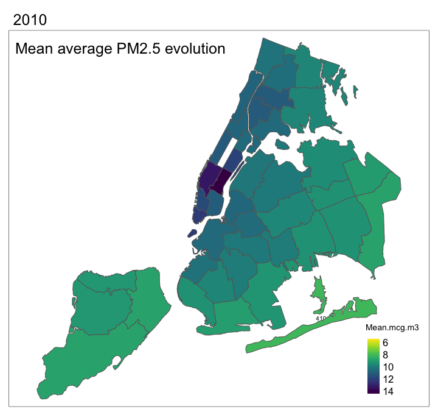

```{r, echo = FALSE, message = FALSE}
source(here::here("scripts/setup.R"))
```

# 3. Exploratory Data Analysis

### 3.1 Mapping the UHF

As we're working on tangible geographical values, it's essential to plot out our variables on a map. For this, we discovered the shapefile format and learnt how to manipulate it. On the NYC open data website, we found a shapefile mapping out all 42 UHF areas(<https://www.nyc.gov/site/doh/data/data-sets/maps-gis-data-files-for-download.page> : "Other GIS DATA", second link(zip file)). Using the *tmap* package, we can see below a map of NYC according to the 42 UHF areas.

```{r, echo = TRUE, fig.keep='all', message=FALSE, warning=FALSE, comment=FALSE, meassage=FALSE, paged.print=FALSE, results='hide'}
library("rgdal")
library("tmap")

# Import geographic file in a variable
UHFmapfile <- readOGR(dsn = here::here("spatial/UHF_42_DOHMH_2009"),layer="UHF_42_DOHMH_2009")
UHFmap <- UHFmapfile[UHFmapfile$OBJECTID > 1,]

# Plot the map
# Simple plot
tm_shape(UHFmap)+
  tm_polygons(col = "white",
              title = "UHFCODE")

# interactive map 10 years with PM2.5
# Rename from categorical to numerical Time column

dfpm2.5$Time <- str_replace(dfpm2.5$Time, "Annual Average", "")
dfpm2.5$Time <- as.numeric(dfpm2.5$Time)

# rename column in pm2.5 to match spf name
colnames(dfpm2.5)[2] = "UHFCODE"

# merge variables from Factors to UHFmap
uhfpm <- merge(UHFmap, dfpm2.5, by = "UHFCODE", duplicateGeoms = TRUE)
# load the viridis package for dynamic graph
library(viridis)
```

Here is a representation of NYC with the detail of each UHF area by number.

```{r, echo = TRUE, fig.keep='all', message=FALSE, warning=FALSE, comment=FALSE, meassage=FALSE, paged.print=FALSE, results='hide'}
tm_shape(UHFmap) +
  tm_polygons(col = "white",
              title = "UHFCODE") + 
    tm_text("UHFCODE", size = 0.5)
```

To better understand the geographical position of each borough, we've created this map and color coded each part of NYC. 

```{r, echo = TRUE, message=FALSE, warning=FALSE, paged.print=FALSE}
# Map NY UHF to Borough

# Connecting geographic info with data frame "Factors"
# rename column UHFCode to match spf name
colnames(Factors)[1] = "UHFCODE"

# merge variables from Factors to UHFmap
testshape <- merge(UHFmap, Factors, by = "UHFCODE")

tm_shape(testshape) +
  tm_polygons(col = "UHFCODE", 
              style = "fixed",
              palette = "Pastel1",
              breaks = c(0, 108, 212, 311, 411,504),
              labels = c("Bronx", "Brooklyn","Manhattan","Queens", "Staten Island"))
```

### 3.2 Mapping the evolution of PM2.5 from 2010 to 2021

With this shapefile, we've created a new visualisation called uhfpm, which we've connected to the original shapefile with the "UHFCODE" variable. Thanks to this, we can now use our dfpm2.5 table.

Then, we did the same with our Factors table and have created the testshape table. We have decided to divide the data into two tables because our PM2.5 values are traced over 11 years, while our Factors table contains data only for one year. Now, we can regroup all UHF Codes to their respective boroughs and map them out on the original shapefile. For precision, we can note that Central Park and JFK Airport were left out of the intial shapefile, hence the large white rectangle in the middle of Manhattan.

```{r, echo = TRUE, message=FALSE,warning=FALSE, paged.print=FALSE}
# Create dataframe to link factors with pm2.5 values for 2017 as reference point
# start by renaming GeoID from factors to UHFCODE
colnames(Factors)[1] = "UHFCODE"
testpm2017 <- filter(dfpm2.5, Time == 2017)
head(testpm2017)
pm2017 <- dplyr::select(testpm2017,UHFCODE,Mean.mcg.m3)
testFactors_and_PM <- merge(pm2017,Factors, by='UHFCODE')

# Remove Geography column
Factors_and_PM <- testFactors_and_PM[,-3]
```

Going further with the use of the shapefile, we use uhfpm to show the evolution of PM2.5 between the years 2010 to 2021. Through this visualization, we saw a decrease in Air pollution levels across all five boroughs of the city. We also find that there are two UHF areas, in the center of Manhattan which have decreased a lot less than the neighbouring areas. Drawing on this, we emit the hypothesis that this area probably has a much higher level of traffic density and lower vegetative cover on average.

```{r, echo = TRUE, message=FALSE, warning=FALSE, paged.print=FALSE}
# Multiple maps per year
tm_shape(uhfpm) +
  tm_polygons(
    col = "Mean.mcg.m3",
    style = "cont",
    pal = viridis(10, direction = -1),
    ) +
  tm_facets(by = "Time", ncol = 3) +
  tm_layout(legend.outside.size = 0.1)
```

### 3.3 Animation of the evolution of PM2.5 from 2010 to 2021

For a better visualization of this evolution, we track the years by using a GIF.

```{r, echo = TRUE, message=FALSE, warning=FALSE, paged.print=FALSE}
# Animated graphic
library(gifski)
library(tmap)
library(viridis)
library(installr)
library(magick)
library(caTools)
#installr::install.imagemagick()
#devtools::install_github('talgalili/installr') 

pf2.5_animation <- tm_shape(uhfpm) +
    tm_text("UHFCODE", size = 0.6 )+
    tm_polygons(
    col = "Mean.mcg.m3",
    style = "cont",
    pal = viridis(10, direction = -1)
    ) +
  tm_facets(along = "Time") +
  tm_layout(legend.position = c("right", "bottom"),title= 'Mean average PM2.5 evolution',title.size = 1.5,legend.title.size = 1, legend.text.size = 1,  title.position = c('left', 'top'))

tmap_animation(pf2.5_animation,filename = "animation.gif",delay = 90)

```
<div align="center">

</div>

We can also visualise this decrease with the evolution of each UHF areas:

```{r, echo = TRUE}
library(purrr)
library(ggplot2)
library(gganimate)

dfpm2.5 %>%
  ggplot( aes(x=dfpm2.5$Time, y=dfpm2.5$Mean.mcg.m3, group=UHFCODE, color=UHFCODE)) +
    geom_line() +
    geom_point() +
    scale_color_viridis(discrete = FALSE) +
    ggtitle("Pm2.5 evolution per UHF code")  +
    ylab("Mean mcg m3") + xlab("Time")+
    transition_reveal(dfpm2.5$Time)
```


```{r, echo = TRUE, message=FALSE, warning=FALSE, paged.print=FALSE}
#Groups income into 3 levels

interval_income <- cut_interval(Factors_and_PM$MedianIncome,3)
test <- table(Factors_and_PM$UHFCODE, interval_income)

Factors_and_PM_Income_Level <- Factors_and_PM %>%
  mutate(cut_interval(Factors_and_PM$MedianIncome,3)) 

colnames(Factors_and_PM_Income_Level)[11] = "Category"
Factors_and_PM_Income_Level$Category <- as.character(Factors_and_PM_Income_Level$Category)

Factors_and_PM_Income_Level[Factors_and_PM_Income_Level == "[2.83e+04,7.95e+04]"] <- "Low"
Factors_and_PM_Income_Level[Factors_and_PM_Income_Level == "(7.95e+04,1.31e+05]"] <- "Medium"
Factors_and_PM_Income_Level[Factors_and_PM_Income_Level == "(1.31e+05,1.82e+05]"] <- "High"
```


### 3.4 Mapping the different factors


We start by mapping out our Vegetative Cover data. This figure gives us the percentage of greenery of a given area. We can see that Manhattan has the lowest values and this perhaps explains why the PM2.5 levels decreased less over the years. In the Bronx, Staten Island and East Queens, we have UHF zones with over 50% of vegetative cover.

```{r, echo = TRUE, message=FALSE,warning=FALSE, paged.print=FALSE}
# Graph of Vegetative Cover per UHF Code
tm_shape(testshape) +
  tm_polygons(col = "VegePercent",
              style = "quantile",
              title = "") +
tm_layout(main.title = "Vegetative Percentage", main.title.size = 1,
title.position = c("right", "top")) + 
    tm_text("VegePercent", size = 0.5)

```

Next, we map out the Walking Subway Distance Percentage: The percentage of population within a quarter-mile of a subway station entrance. As predicted, the center of NYC has the highest values while the less urban areas have lower values, even 0.

```{r, echo = TRUE, message=FALSE,warning=FALSE, paged.print=FALSE}
tm_shape(testshape) +
  tm_polygons(col = "WalkSubDist",
              style = "quantile",
              title = "") +
tm_layout(main.title = "Walking Subway Distance Percentage", main.title.size = 1, 
title.position = c("left", "top")) + 
    tm_text("WalkSubDist", size = 0.5)
```

Our third map shows us the Bicyle Road Percentage: Percent of Streets with Bicycle Lanes. We see that Manhattan has double digit values for all its UHF codes while the other boroughs have clearly less bike lanes.

```{r, echo = TRUE, message=FALSE,warning=FALSE, paged.print=FALSE}
tm_shape(testshape) +
  tm_polygons(col = "BicPercent",
              style = "quantile",
              title = "") +
tm_layout(main.title = "Bicycle Road Percentage", main.title.size = 1, 
title.position = c("right", "top")) + 
    tm_text("BicPercent", size = 0.5)
```

Next, we plot the Subway Density. This represents the count of subways stations divided by the total land area in km2 of the UHF neighborhood. Similar to the Subway Walking Distance data, Manhattan & Brooklyn have higher values while the more rural areas are left out.

```{r, echo = TRUE, message=FALSE,warning=FALSE, paged.print=FALSE}
tm_shape(testshape) +
  tm_polygons(col = "SubDensity",
              style = "quantile",
              title = "") +
tm_layout(main.title = "Subway Density", main.title.size = 1, 
title.position = c("right", "top"))
```

Regarding Median Income, we can clearly see Manhattan residents have a better financial situation than the rest of NYC. Between the Upper East Side & East Harlem, the median Income is divided by four. In other boroughs, we have mixed results of poor, middle class and rich UHF areas.

```{r, echo = TRUE, message=FALSE,warning=FALSE, paged.print=FALSE}
tm_shape(testshape) +
  tm_polygons(col = "MedianIncome",
              style = "quantile",
              title = "") +
tm_layout(main.title = "Median Income", main.title.size = 1, 
title.position = c("right", "top"))
```

Last but not least, we map the Population Density per Km2 and find that Manhattan has the highest concentrations of population.

```{r, echo = TRUE, message=FALSE,warning=FALSE, paged.print=FALSE}
tm_shape(testshape) +
  tm_polygons(col = "Popdensity",
              style = "quantile",
              title = "") +
tm_layout(main.title = "Population Density (Per Km2)", main.title.size = 1, 
title.position = c("right", "top")) 
```

```{r, echo = FALSE, message=FALSE, warning=FALSE, paged.print=FALSE}

# See shiny app in shiny folder
# If the app doesn't launch -> need to load Markdown files of data and eda prior.

```

Here, we used *shiny* with the *leaflet* package to visualise all the different variables on an interactive map. This visualisation allows us to better distinguish each UHF individually by zooming in and having the area number appear when moving the mouse.

### 3.5 Comparison of Top 5 most & Top 5 least polluted UHF areas in 2021 against PM2.5

```{r, echo = TRUE, fig.width= 10, fig.height=11, message=FALSE, warning=FALSE, paged.print=FALSE}
# Create dataframe to link factors with pm2.5 values for 2017 as reference point
# start by renaming GeoID from factors to UHFCODE
colnames(Factors)[1] = "UHFCODE"
testpm2017 <- filter(dfpm2.5, Time == 2017)
head(testpm2017)
pm2017 <- dplyr::select(testpm2017,UHFCODE,Mean.mcg.m3)
testFactors_and_PM <- merge(pm2017,Factors, by='UHFCODE')

# Remove Geography column
Factors_and_PM <- testFactors_and_PM[,-3]
```

The below graph illustrates how the five most polluted UHF areas of NYC differ in regards to the observed variables. Through this we aim to see if there are similiraties between these areas in order to have a glimpse of air pollution drivers. There is great dispersion for Vegetative percent and Walking distance to Subways. Traffic density and Bicpercent are rather grouped. All five UHF areas have high Vegetative cover percent, and this may be a predictor for PM2.5. We also see Subway Density is almost the same value for every area, leading us to believe this will not impact air pollution.

```{r, echo = TRUE, fig.width= 10, fig.height=11, message=FALSE, warning=FALSE, paged.print=FALSE}
# Top5
TOPI <- Factors_and_PM_Income_Level[(order(Factors_and_PM_Income_Level$Mean.mcg.m3, decreasing = FALSE)),]

valuez <- table(TOPI$Mean.mcg.m3[1:5])

Top5 <- filter(Factors_and_PM_Income_Level,Mean.mcg.m3 %in% c(6.32, 6.58,6.75,6.8,6.83)) 

Top5 <- Top5[,-11]

# Pivot Longer
TOP5_longer <- Top5 %>%
  pivot_longer(c("Mean.mcg.m3","VegePercent", "WalkSubDist", "BicPercent", "NeighPercent", "SubDensity","TrafDensity"), names_to = "Borough", values_to = "Values")

TOP5_longer$UHFCODE <- as.character(TOP5_longer$UHFCODE)

# plot
library(ggiraph)
top <- ggplot(TOP5_longer, aes(x=Values, y=Borough,tooltip = UHFCODE)) +
  geom_segment( aes(x=0, xend=Values, y=Borough, yend=Borough)) +
  geom_point_interactive(color="Blue", fill=alpha("black", 0.3), shape=21, stroke=2)+
  ggtitle("Five least polluted UHF areas")+
  theme(axis.text=element_text(size=15))

girafe(ggobj = top)
```

<br>

The below chart shows the common factors of the five most polluted UHF areas. First, we see that the level of Vegetative Percent is strikingly low compared to the top five least polluted areas. Secondly, their traffic density is significantly higher. Finally, the BicPercent is far higher. These seem to be characteristics of a highly busy part of a city.

```{r, echo = TRUE, fig.width= 10, fig.height=11, message=FALSE, warning=FALSE, paged.print=FALSE}
# Flop5
FLOPI <- Factors_and_PM_Income_Level[(order(Factors_and_PM_Income_Level$Mean.mcg.m3, decreasing = TRUE)),]

valuezz <- table(FLOPI$Mean.mcg.m3[1:5])

Flop5 <- filter(Factors_and_PM_Income_Level,Mean.mcg.m3 %in% c(8.98, 9.01,9.02,9.91,10.33)) 

Flop5 <- Flop5[,-c(9,10,11)]

# Pivot longer
FLOP5_longer <- Flop5 %>%
  pivot_longer(c("Mean.mcg.m3","VegePercent", "WalkSubDist", "BicPercent", "NeighPercent", "SubDensity","TrafDensity"), names_to = "Borough", values_to = "Values")

# plot
library(ggiraph)
flop <- ggplot(FLOP5_longer, aes(x=Values, y=Borough,tooltip = UHFCODE)) +
  geom_segment(aes(x=0, xend=Values, y=Borough, yend=Borough)) +
  geom_point_interactive(color="Blue", fill=alpha("black", 0.3), alpha=0.7, shape=21, stroke=2)+
  ggtitle("Five most polluted UHF areas")+
  theme(axis.text=element_text(size=15))

girafe(ggobj = flop)
```